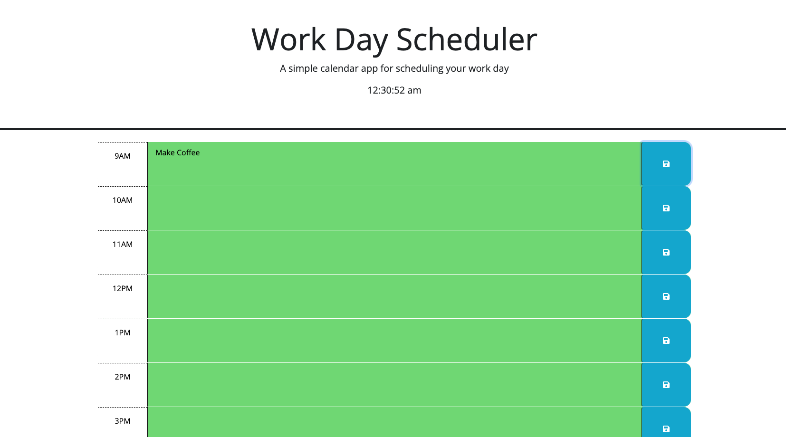

# work-day-scheduler# 

## Description

The purpose of this project was to build a work day scheduler that would organize a standard 9-5 workday using color coded hour blocks and text descriptions for specific tasks in each hour block. Building this project allowed me to work with JQuery in conjunction with HTML and CSS to build a dynamic scheduler that would save previous local storage inputs and display them in the corresponding hour block. I used JQuery to display the current time, save text inputs in Local Storage, and color code hour blocks based on their relationship to the current time.

## Installation

No installation required.

## Usage

Click on  [this link](https://dhclarke99.github.io/work-day-scheduler/) to deploy the webpage. 

